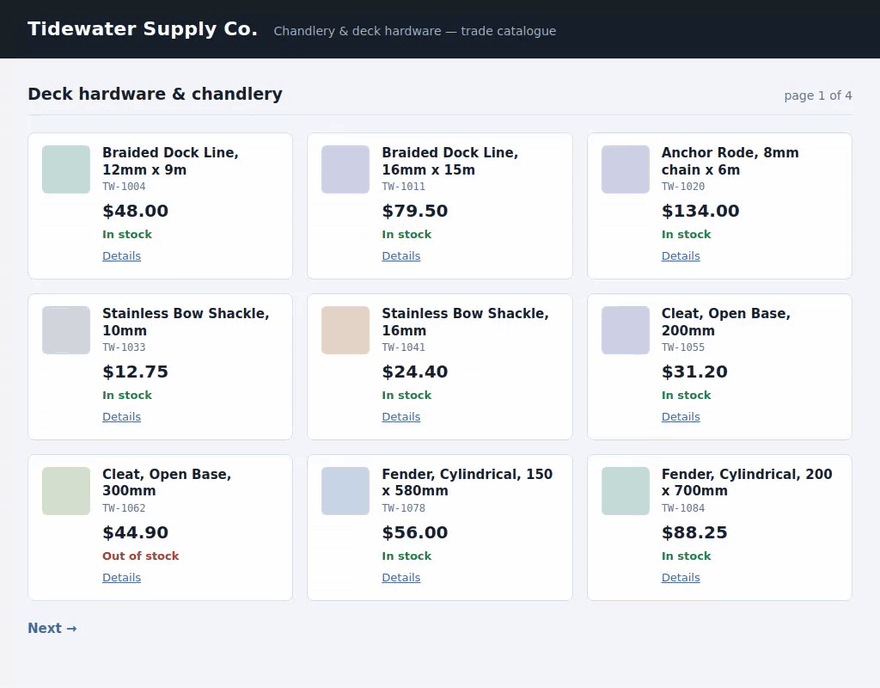

# catalog-watch — a product catalogue, watched overnight

Point it at a catalogue. It runs every morning on a schedule and tells you what
changed since yesterday: price moves, things that went out of stock, new
listings, products that quietly disappeared.



Outputs a CSV, an XLSX and a plain-text change summary. The summary is what the
scheduled job emails you; the spreadsheets are for when you want to dig.

```
6 changes since the previous run

  price cut   TW-1004    Braided Dock Line, 12mm x 9m        48.00 -> 41.50      -6.50 USD (-13.5%)
  price cut   TW-1084    Fender, Cylindrical, 200 x 700mm    88.25 -> 79.95      -8.30 USD (-9.4%)
  price up    TW-2057    Seacock, Bronze, 25mm               87.40 -> 94.80      +7.40 USD (+8.5%)
  stock       TW-1078    Fender, Cylindrical, 150 x 580mm    in stock -> out of stock
  new         TW-2125    Storm Jib Sheet, 10mm x 12m         -> 57.40 USD        new listing
  delisted    TW-2101    Stainless Polish, 500ml             14.80 ->            no longer listed

1 product needing review (read, not guessed):
  review      TW-1130    Deck Hatch, 450 x 450mm             price: no number in 'Call for pricing'
```

## The demo scrapes a bundled fixture, not a live site

**The target in this repo is a synthetic storefront served from
`fixtures/`.** It is not a real shop, the products are invented, and nothing
here touches a third-party site.

That is a deliberate choice, not a limitation being hidden:

- A demo that hammers somebody else's storefront every time it runs is a
  liability nobody needs.
- A live site breaks the recording the week it redesigns.
- A local fixture makes the run-to-run diff **deterministic**, which is the
  entire point of the piece — you can see the same six changes every time.

Pointing it at a real catalogue is a config change, not a code change: a URL
and a site profile. See [Pointing it at a real catalogue](#pointing-it-at-a-real-catalogue).

## Install and run

Needs `make`, `curl` and a 64-bit Linux or macOS. That is the whole list — it
does **not** need you to have Python 3.12, `pip` or `uv` set up first.

```bash
git clone <this repo> && cd catalog-watch
make run
```

**9 to 10 seconds** from a dead clone to real output — 9.0, 9.4, 9.4, 9.6, 9.9
and 10.2 s over six clones in two passes, measured with an empty `HOME` and
`PATH=/usr/bin:/bin`: no `uv`, no virtualenv, no caches. Most of that is
fetching a pinned `uv`. On a machine with no Python 3.12 at all, uv downloads
an interpreter too, which will be slower again — this box has 3.12, so I have
no measurement of that case and have not put a number on it.

`make run` does two runs a day apart, because one run of a change report has
nothing to report:

```
=== run 1 of 2: yesterday's catalogue (fixtures/site) ===
30 products on 4 pages · 29 read clean · 1 needing review
First run: this is the baseline. The next run reports what moved.

=== run 2 of 2: this morning's catalogue (fixtures/site-day2) ===
6 changes since the previous run
  ...
```

```bash
make test              # the test suite
make schedule-check    # prove the cron wrapper works, under cron's environment
make demo              # regenerate the clip above, headless
```

`make demo` is the slow one, because it renders a real browser and has to
download a headless Chromium to do it. Measured on this machine: **28 to 30
seconds** to re-record once the toolchain is there — 28.1, 28.2, 28.4, 28.5,
29.8 and 29.8 s over six runs in two passes, and 29.3 s on one run after the
title card joined both encodes, which is inside that range: drawing the card
and prepending 0.8 s to two encodes cost less than the spread between the six.
The first run adds the Chromium
download on top of that, which I have not timed, so the wall clock for a first
`make demo` is the one number here I cannot give you. It leaves **762 MB** in
`demo/.toolchain/` — 549 MB of that the unpacked Chromium, and 2 MB the
typeface `demo/lib/fonts.sh` pins for the title card — all of it inside
the repo and none of it installed system-wide. `make clean` removes it.

If you would rather use your own tooling:

```bash
uv venv && uv pip install -e '.[dev]'            # or:
python3 -m venv .venv && .venv/bin/pip install -e '.[dev]'

.venv/bin/python watch.py --serve fixtures/site-day2 --report
```

That last line is the whole tool. Everything above it is just getting a Python
that can run it.

## How the diffing works

The tool keeps one file — `state/catalog.json` — holding everything the last
run saw. The next run scrapes, compares against that file, writes the report,
and replaces the file. That is the whole mechanism, and it means:

- **The diff is real.** Delete the state file and the next run is a baseline
  again. `--no-state` reports against the previous run without advancing it,
  which is how to dry-run a change.
- **A missed morning is not a lost day.** If the machine was off on Tuesday,
  Wednesday's run reports everything that moved since Monday.
- **Nothing is inferred from a previous run.** The state file is the thing
  being compared *against*; it never fills in a field the current run could not
  read.

## What it reports

| Change | When |
| --- | --- |
| `price cut` / `price up` | The printed price moved. Reported with the delta and the percentage. |
| `stock` | Availability moved between in stock, out of stock, back-order, pre-order, discontinued. |
| `renamed` | The product name on the card changed. |
| `new` | A sku that was not there yesterday. |
| `delisted` | A sku that was there yesterday and is not on the pages we scraped today. |
| `unreadable` | A field that used to read fine and did not this morning. |
| `readable` | A field that was unreadable and is readable again. |

`unreadable` is the one that matters. If yesterday's price was 48.00 and today
the page says "Call for pricing", that is **not** a price cut to zero and it is
not a price that stayed the same. It is a field we could not read, and it is
reported as exactly that.

## When it flags a product

A field that cannot be read is left **empty and flagged**. It is never guessed,
never carried over from the previous run, and never inferred from a
neighbouring field. The `needs_review` column says `yes` and `issues` says why:

- `price: no number in 'Call for pricing'` — the element is there, its contents
  are not a price.
- `price: more than one number in '$60.00 $48.00'` — a was/now cell. Picking one
  would be a guess, and usually means the selector is pointing one level too high.
- `price: not on the card` — a required field whose element is missing.
- `availability: unrecognised value 'Ask in store'` — a stock state not in the
  profile's vocabulary. Add it to `availability_map` if it is real.
- A product card with no readable sku cannot be matched between runs at all, so
  it is skipped and counted in a `note:` line rather than given an invented key.

The run still finishes, still writes all three files, and still exits `0`. Use
`--fail-on-review` if you would rather it did not.

## Scraping politely

A scraper that gets the client's IP blocked in week two is worse than no
scraper. So, by default:

- `robots.txt` is read before the first request and **disallowed paths are
  refused**. `--ignore-robots` exists, for sites you have an agreement with.
- The site's `Crawl-delay` is honoured if it asks for more than the built-in
  0.5 s. (Python's own `urllib.robotparser` silently drops fractional delays —
  this reads them properly.)
- Requests carry a User-Agent that says what the tool is.
- `--max-pages` caps the crawl, and hitting the cap is reported rather than
  passed off as the end of the catalogue.
- A `404` is an answer and is not retried. A `503` is a wobble and is.

## Scheduling

`make schedule-check` runs the wrapper three times under `env -i` — cron's
environment, not your shell's — and checks it produces a baseline, then six
deltas, then nothing. The two things that break scheduled jobs are a missing
PATH/virtualenv and a diff that was never really a diff; both are covered
there.

```bash
make schedule-check
```

Then install it with either the crontab fragment or the systemd timer in
[`schedule/`](schedule/README.md). Both call the same `schedule/run.sh`, both
take their configuration from environment variables, and `run.sh` passes
watch.py's exit code through so you can alert on `--fail-on-change` returning
`2` rather than parsing text.

## Pointing it at a real catalogue

Two things change, neither of them code.

**1. A site profile.** `sites/fixture.json` is a small JSON file of CSS
selectors:

```json
{
  "name": "Tidewater Supply Co. (bundled fixture)",
  "product": { "selector": "article.product" },
  "fields": {
    "sku":          { "selector": ".sku" },
    "name":         { "selector": ".product-name" },
    "price":        { "selector": ".price", "parse": "money" },
    "availability": { "selector": ".stock", "parse": "availability" },
    "url":          { "selector": "a.product-link", "attr": "href", "parse": "url" }
  },
  "required": ["sku", "name", "price"],
  "pagination": { "next_selector": "a.next", "max_pages": 25 },
  "availability_map": { "back-order": "backorder", "pre-order": "preorder" }
}
```

Field selectors are matched inside each product card. `parse` is one of `text`
(the default), `money`, `availability` or `url`. `required` decides which
missing fields get flagged. A typo in a field name is an error at load time,
not forty pages into a crawl.

**2. A URL instead of `--serve`.**

```bash
.venv/bin/python watch.py https://shop.example.com/collections/all \
  --site sites/theirshop.json --report
```

Or, for the scheduled job, set `CATALOG_WATCH_TARGET` and
`CATALOG_WATCH_SITE`. See [`schedule/README.md`](schedule/README.md).

## Options

```
watch.py [URL | --serve DIR] [--site profile.json] [--state file.json]
         [--out DIR] [--report] [--delay S] [--timeout S] [--max-pages N]
         [--ignore-robots] [--no-state] [--fail-on-review] [--fail-on-change]
         [--quiet]
```

| Flag | Effect |
| --- | --- |
| `--serve DIR` | Serve `DIR` on localhost and scrape that. How the bundled fixture demo works; for a real target, pass a URL instead. |
| `--site` | Site profile JSON. Default `sites/fixture.json`. |
| `--state` | The previous run. Default `state/catalog.json`. Delete it to start a new baseline. |
| `--out` | Where `products.csv`, `products.xlsx` and `changes.txt` go. Default `out/`. |
| `--report` | Print the change summary to stdout. |
| `--delay` | Seconds between requests. Default 0.5 for a remote URL, 0 for `--serve`. The site's `Crawl-delay` wins if it asks for more. |
| `--max-pages` | Override the profile's page cap. |
| `--ignore-robots` | Scrape paths robots.txt disallows. Only with the site owner's agreement. |
| `--no-state` | Report against the previous run without overwriting it. A dry run. |
| `--fail-on-review` | Exit 1 if any product is flagged. |
| `--fail-on-change` | Exit 2 if anything changed. For alerting. |

Exit codes: `0` fine, `1` needs review, `2` changed, `3` usage or site-profile
problem, `4` the site could not be fetched.

## What the output looks like

`out/products.csv` — one row per product currently listed, plus one for each
product that disappeared, so nothing drops out of the file without a trace:

```
sku,name,price,currency,availability,url,status,change,change_detail,needs_review,issues
TW-1004,"Braided Dock Line, 12mm x 9m",41.50,USD,in_stock,http://…/products/TW-1004.html,listed,price cut,48.00 -> 41.50 (-6.50 USD (-13.5%)),no,
TW-1130,"Deck Hatch, 450 x 450mm",,USD,in_stock,http://…/products/TW-1130.html,listed,,,yes,price: no number in 'Call for pricing'
TW-2101,"Stainless Polish, 500ml",14.80,USD,in_stock,http://…/products/TW-2101.html,delisted,delisted,14.80 -> (no longer listed),no,
```

`out/products.xlsx` — three sheets. **Changes** first, because that is the
question the file is opened to answer, with price cuts in green and rises in
red. Then **Catalogue**, the full snapshot with flagged rows highlighted. Then
**Run**, a copy of the text summary.

`out/changes.txt` — the summary at the top of this README.

### Two runs over one catalogue write the same bytes, but for the run clock

Run this against an unchanged catalogue twice and `cmp` says the files are the
same, apart from the two timestamps below, so "nothing moved overnight" is a
question you can answer without opening anything. Three things would otherwise
have moved on their own, and all three are pinned: the zip member timestamps
and the Office document clock inside the `.xlsx`, both flattened after the
save, and the origin in the `url` column — `--serve` binds an ephemeral port so
runs never collide, and the port is dropped on the way out, because a fixture
page is identified by its path.

The exemption is the run summary, which prints two timestamps: `run at
<timestamp>`, and `compared against the run at <timestamp>` for the snapshot
it diffed. Those are the lines you check to know this morning's 06:00 run
actually happened and what it measured itself against, and they are kept on
purpose. They appear twice, because the **Run** sheet is a copy of
`out/changes.txt` — so `out/changes.txt` and `out/products.xlsx` move, and
nothing else does. `out/products.csv` has no exemption at all and is
`cmp`-identical. `tests/test_report.py` asserts each of these with the clock
moved by hand — both clocks, separately, so neither can quietly spread to
another sheet.

## Sample data

`fixtures/site/` and `fixtures/site-day2/` are two revisions of an invented
storefront — 30 products across 4 pages, one price rise, two cuts, one product
that goes out of stock, one new listing, one delisting, and one product whose
price says "Call for pricing" on both days so the flagging behaviour is visible
in every run. `Tidewater Supply Co.` is not a company and no real product,
vendor or client data is anywhere in this repo or in the recording.

Both revisions and `tests/expected_changes.json` come out of one table in
`fixtures/generate_site.py`, so the end-to-end tests assert against the
storefront rather than against the tool's own output.

```bash
make fixtures     # regenerate them
```

## Limits, honestly

- **Server-rendered HTML only.** A catalogue that renders its products in
  JavaScript returns an empty product list here, and the run reports zero
  products rather than pretending. That is a different tool — a headless
  browser per page, seconds instead of milliseconds, and a much bigger
  conversation about rate limits.
- **One profile per site layout.** A storefront that renders its sale items
  with a different card structure needs either a selector that matches both or
  a second run with a second profile.
- **Products are matched by sku.** A shop that does not print a stable
  identifier on the card cannot be diffed reliably, and this tool says so
  (cards with no readable sku are skipped and counted) rather than matching on
  name and reporting a rename as a delisting plus a new listing.
- **It reads what is printed.** A price shown inclusive of tax on one day and
  exclusive the next is a price change as far as this is concerned. It reports
  what the page says; it does not model the shop's pricing.
- **No login, no cart, no JavaScript, no proxies.** It fetches public catalogue
  pages politely and reads them.
- Tested against the bundled fixture and a spread of unit tests on hand-written
  HTML. On a real storefront the honest expectation is that most products parse
  clean and the rest get flagged rather than silently wrong. That is what the
  flag is for.

## Tests

```bash
make test          # or: .venv/bin/python -m pytest -q
```

285 tests, four of which skip in a dead clone: the two `ffprobe` cross-checks in
`tests/test_readme_clip.py`, and in `tests/test_demo_card.py` the comparison of
`demo/out/poster.png` against frame 0 of the mp4 and the proof that the title
card's typeface is the vendored one. All four want something `make demo`
downloads, and all four are cross-checks rather than guards: the guard each one
backs up runs anyway, over `demo/out/demo.gif` — the file this README embeds —
which is read end to end with nothing but the standard library.

| File | Covers |
| --- | --- |
| `test_scrape.py` | Parsing rules on HTML strings: money, availability, missing and unreadable fields, pagination. |
| `test_diff.py` | The comparison, including that an unreadable field is never reported as a change in value. |
| `test_state.py` | The state file round trip, atomic writes, and refusing a corrupt or future-version file. |
| `test_fetch.py` | robots.txt, `Crawl-delay` parsing, retry policy, failure messages. |
| `test_site.py` | Site profiles failing at load time with a message that says what to fix. |
| `test_report.py` | CSV shape, XLSX sheets, and the wording of the summary. |
| `test_cli.py` | End to end over real HTTP against the fixture, asserting against `tests/expected_changes.json`. |
| `test_demo_preview.py` | The table renderer in `demo/lib/`: column picking, row caps, the `…` truncation, and erroring on a column the file does not have. |
| `test_demo_fetch.py` | The download retry ladder in `demo/lib/fetch.sh` — the recording toolchain's downloads, not the scraper's — driven against a `curl` shim that fails a scripted number of times. |
| `test_demo_outputs.py` | That the recording writes both the GIF and the MP4, including the case where `vhs` exits `0` having skipped one of them. |
| `test_demo_sheet.py` | The shared spreadsheet renderer in `demo/lib/sheet.py`, which draws the clip's closing frame: that it refuses to render a file that is not on disk, that a filtered view keeps the source file's own column letters and row numbers, and that the command on screen is the one whose output is under it. |
| `test_readme_clip.py` | The clip-length sentence in this README, read back off the committed `demo/out/demo.gif` and `demo/out/demo.mp4`. It parses the numbers out of README.md rather than restating them, so a re-record that moves the clip and leaves the prose behind fails here. The duration readers are stdlib, because a dead clone has no `ffprobe`, and they are pinned against hand-built mp4 and gif headers. |
| `test_readme_counts.py` | The test counts in this README, read back off `pytest --collect-only`: the total, the dead-clone skip figure (off the ffprobe cross-check's own parametrised count, not a number typed twice) and any per-file split quoted below. A count is deterministic, so it is guarded; the wall clocks are not, and `make timings` covers those. |

### The numbers a test cannot guard

```bash
make timings          # measure them, and diff them against this file
make timings ARGS="--list"
```

A test count is deterministic, so it is guarded above. The wall clocks and disk
sizes in this file are not: they move with the machine, the network and the
pinned versions. Asserting them in the suite would buy a flaky one rather than
a guard, so they get `tools/timings.py` instead — a target run by hand before a
push, never in CI, which re-measures each of them, prints the sentence in this
README that states it, and says whether the two still agree. It exits non-zero
when they do not, so `make` reports `Error 1`; that is the verdict arriving, not
a crash.

## Recording the demo

`./demo/record.sh` regenerates the clip at the top of this file from scratch,
headless, on the synthetic fixture. It is a reusable pipeline with two recipes —
a browser one and a terminal one — documented in
[demo/README.md](demo/README.md).

The clip is 22 s against a 35 s budget that `record.sh` enforces by reading the
encoded file, so the guard is real rather than a note about not shipping a
two-minute GIF. That sentence is itself checked:
`tests/test_readme_clip.py` parses the two numbers out of this file and reads
the duration back off the committed `demo/out/demo.gif` and `demo/out/demo.mp4`,
so a re-record that moves the clip and leaves the README behind fails the suite.

`record.sh` also refuses a take whose encodes do not *end* on the held final
shot. `demo/lib/lastframe.py` decodes each encode from the first frame and
requires the last second to be one picture, which is what catches a leaked
capture frame landing on the frame a player holds after playback stops — the
frame that is left on screen, and the one nothing used to check.

**The clip ends on the real file.** After the morning run, the scene opens
`out/products.xlsx` — the workbook that run just wrote — and reads it off disk.
The marks drawn on the storefront come from `out/products.csv` the same way.
Neither is a fixture, and if the run does not write its output the recording
fails rather than showing you a picture of what it usually writes.

## Layout

```
watch.py                     CLI entry point
catalog_watch/
  scrape.py                  HTML in, products out. Pure.
  diff.py                    two snapshots in, changes out. Pure.
  state.py                   the previous run, on disk
  fetch.py                   HTTP, robots.txt, delays, retries
  site.py                    site profiles, loaded and validated
  report.py                  CSV, XLSX and the text summary
  serve.py                   serves the bundled fixture on localhost
  models.py                  Product, Snapshot, Change
  cli.py                     arguments, the crawl loop, exit codes
sites/fixture.json           the profile for the bundled fixture
fixtures/generate_site.py    writes both storefront revisions and the ground truth
schedule/                    cron and systemd, plus a check that proves they work
demo/                        the headless recording pipeline
```
